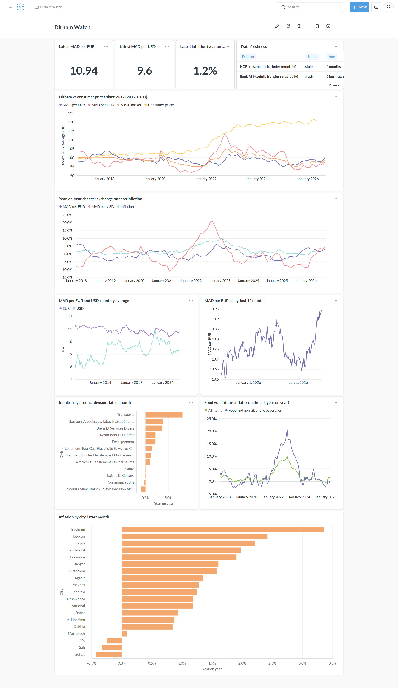
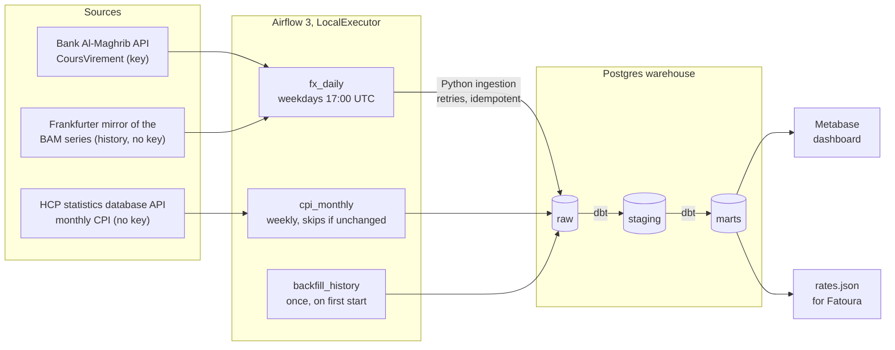
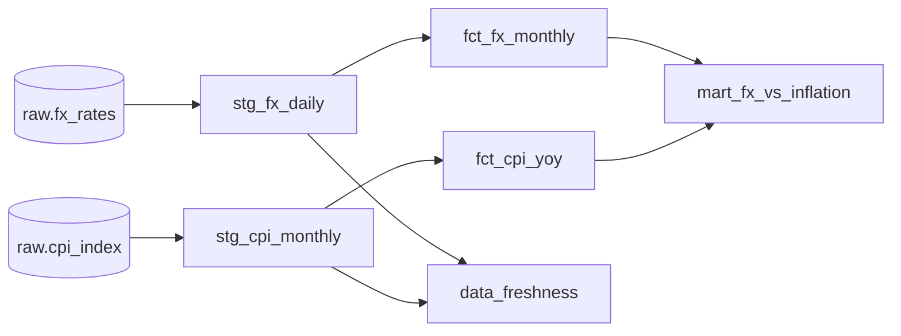
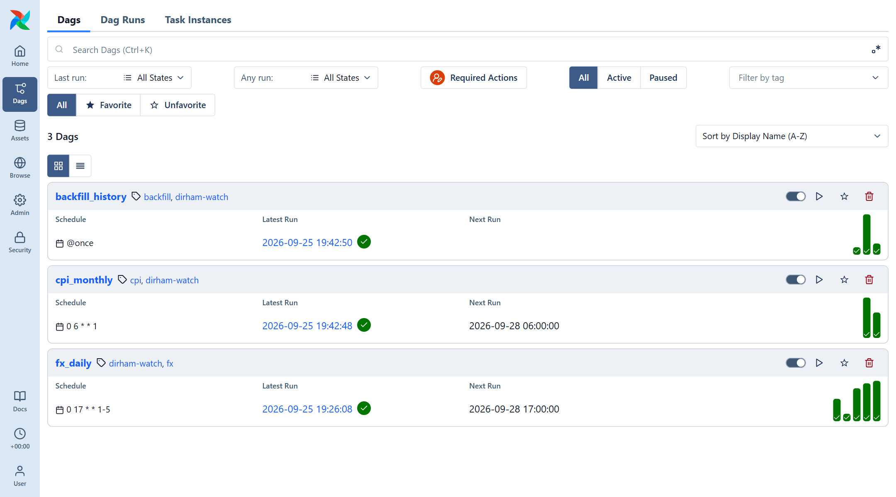

# Dirham Watch

[](https://github.com/MokhtarLahjaily/dirham-watch/actions/workflows/ci.yml)
[](LICENSE)


**How has the Moroccan dirham moved against the euro and the dollar, and how does that
compare with inflation?** Dirham Watch answers it with a scheduled pipeline over Bank
Al-Maghrib exchange rates and the HCP consumer price index: Python ingestion, Airflow,
Postgres, dbt and Metabase, all in Docker Compose.



| Measured | |
|---|---|
| History loaded | **16.7 years** of daily rates (2010-01-04 to today, 4,051 business days, all 30 currencies Bank Al-Maghrib quotes) and 113 months of CPI, January 2017 to May 2026 (310,072 index values: 19 cities × 148 product groups) |
| Tests | **115**: 61 dbt (56 data tests, 5 unit tests), 48 ingestion (pytest, incl. Postgres load and concurrency tests), 6 DAG integrity |
| Freshness | Rates are **0–1 business day** old (checked each weekday); `dbt source freshness` fails past **3 business days** |
| Cold start | `docker compose up` on an empty volume (image built) to a loaded, tested warehouse in **about 5 minutes**, most of it spent respecting the rate limit of the keyless FX mirror |

## Findings

1. **Prices moved, the dirham did not.** From the 2017 base to May 2026, consumer prices
   rose **20.4 %**, while the dirham's 60/40 euro-dollar basket stands at **96.9**
   (2017 = 100). The 2022–23 surge was a price shock, not a depreciation: inflation peaked
   at **10.1 %** in February 2023 and food inflation at **20.8 %**. The only large currency
   move was against the dollar: MAD per USD peaked at **11.10** on 28 September 2022,
   **+21 %** year on year in October 2022.
2. **Then prices fell.** Inflation turned negative for four months, November 2025 to
   February 2026 (lowest **−0.8 %** in January, food **−2.4 %**), before returning to
   **+1.2 %** in May 2026. Jewellery is the outlier: **+52 %** in a year, with the price of
   gold.
3. **The wider band shows up in the data.** Daily volatility of MAD/EUR went from **2.6 %**
   annualised under the ±0.3 % band (2010 to January 2018) to **4.9 %** since Bank
   Al-Maghrib widened it to ±5 % in March 2020.
4. **The open-data copy of the CPI is broken.** The data.gov.ma export of this index stops
   in November 2024, and every city's all-items row in it is an exact copy of a *national*
   sub-index (Rabat's is national oils and fats, Meknès' national vegetables), giving
   Meknès inflation from −18 % to +49 %. Against HCP's own statistics database, 5.8 % of its
   city values differ while national values match exactly. The pipeline now reads HCP's
   database API, 18 months fresher and correct, and keeps a check that detects and
   quarantines copied series.

## Architecture



- **Ingestion** ([`ingestion/`](ingestion/src/dirham_watch)): typed clients with
  retries (exponential backoff, `Retry-After` honoured on 429). Each load is a
  delete-then-insert of its window in one transaction, so re-runs and backfills are
  idempotent, and a Postgres advisory lock stops a daily run and a backfill from racing.
- **Orchestration** ([`airflow/dags/`](airflow/dags)): `fx_daily` re-fetches the last 7
  days so missed runs heal themselves; `cpi_monthly` compares HCP's update date for the index
  and skips everything when it has not changed; dbt tasks share a one-slot pool.
- **Transformation** ([`dbt/`](dbt)): `raw` keeps what the sources returned, including
  duplicate rows. Staging types, deduplicates and normalises; marts answer the question.
- **Dashboard** ([`metabase/setup_metabase.py`](metabase/setup_metabase.py)): provisioned
  through the Metabase API (admin, read-only warehouse connection, 10 questions, the
  dashboard); idempotent, and `--check` runs every question.

### dbt models



| Model | Grain | Notes |
|---|---|---|
| `stg_fx_daily` | day × currency | MAD per 1 unit; per-100 quotes (JPY, SEK…) divided; pre-2016 bid/ask midpoint; direct BAM beats the mirror, then latest load |
| `stg_cpi_monthly` | month × city × product group | Parses COICOP-style codes and levels, drops `-`, flags series copied from another national group |
| `fct_fx_monthly` | month × currency | Average, min, max, end of month; month-on-month and year-on-year change joined by date, so a missing month gives null instead of a wrong comparison |
| `fct_cpi_yoy` | month × city × product group | Monthly and annual inflation, without quarantined series |
| `mart_fx_vs_inflation` | month (since 2017) | MAD/EUR, MAD/USD and 60/40 basket rebased to 2017 = 100 next to CPI; year-on-year changes; food inflation |
| `data_freshness` | dataset | A view, so the lag is computed when the dashboard asks |

### Data quality

- **Source freshness in business days.** dbt measures freshness in calendar time. A
  custom `loaded_at_query` ([`macros/freshness.sql`](dbt/macros/freshness.sql)) returns
  `now() − (business days since the latest rate)`, so `error_after: 3 days` means *three
  business days*: a Friday rate is still fresh on Wednesday, stale on Thursday.
- **Tests:** unique (date, currency) and (month, city, group); accepted ranges (EUR/MAD
  9–13, USD/MAD 6.5–12, month-on-month moves, headline inflation); contiguous months in
  the mart; the basket between its two components; duplicates in the raw API response
  must agree.
- **Unit tests** (dbt 1.8+) pin the logic that is easy to get wrong: unit and
  source-priority rules, gap-safe month-on-month, business-day counting, the copy detection.

## Run it

Requires Docker with about 4 GB of memory.

```bash
git clone https://github.com/MokhtarLahjaily/dirham-watch.git && cd dirham-watch
cp .env.example .env        # then replace every change-me value
docker compose up -d --build
```

On the first start, `backfill_history` loads the history and builds the warehouse by
itself (about 5 minutes).

| Service | URL | Login |
|---|---|---|
| Metabase dashboard | http://localhost:3000 | `MB_ADMIN_EMAIL` / `MB_ADMIN_PASSWORD` |
| Airflow | http://localhost:8080 | `AIRFLOW_ADMIN_USER` / `AIRFLOW_ADMIN_PASSWORD` |
| Postgres warehouse | `localhost:5433`, database `warehouse` | `dirham` / `WAREHOUSE_PASSWORD` |

Ports are set in `.env` (`METABASE_HOST_PORT`, `AIRFLOW_HOST_PORT`, `WAREHOUSE_HOST_PORT`).
After editing a dashboard question, re-provision and run every question once:
`docker compose run --rm --no-deps metabase-setup python /setup/setup_metabase.py --check`.
With a free [Bank Al-Maghrib API key](https://apihelpdesk.centralbankofmorocco.ma)
(product "Marché des changes") in `BAM_API_KEY`, `fx_daily` reads the central bank's API
directly; without one, the keyless mirror of the same series. The API allows **5 calls per
minute** and needs one call per business day, so history always comes from the mirror
(`FX_BACKFILL_SOURCE`): about 1 minute instead of 15 hours. Over 172 overlapping rates the
two sources agree exactly, and staging prefers the central bank's rows where both exist.



### Develop and test locally

```bash
python -m venv .venv && . .venv/bin/activate        # Windows: .venv\Scripts\activate
pip install -e "ingestion[dev]" "dbt-core~=1.12.0" "dbt-postgres~=1.11.0" "sqlfluff~=4.3"

# Ingestion tests. Load tests use throwaway schemas, never the real raw schema.
set -a; . ./.env; set +a; export WAREHOUSE_HOST=localhost WAREHOUSE_PORT=5433
(cd ingestion && pytest)

# The CLI the DAGs use
dirham-watch fx --backfill       # or: --start 2024-01-01 --end 2024-12-31 --source frankfurter
dirham-watch cpi                 # skips when HCP's update date is unchanged; --force reloads
dirham-watch export-rates --out exports/rates.json

# dbt against the Compose warehouse
cd dbt && export DBT_PROFILES_DIR=. && dbt deps && dbt build && dbt source freshness
sqlfluff lint models tests
```

CI ([`.github/workflows/ci.yml`](.github/workflows/ci.yml)) runs ruff, sqlfluff and a
Compose config check; the ingestion tests against a Postgres service container; `dbt build`
and `dbt source freshness` on [real-data fixtures](scripts/make_ci_fixtures.py) (EUR/USD
since 2016 plus a recorded BAM response, and the CPI all-items and divisions for three
cities); and the DAG integrity tests on Airflow 3.3.

## Project layout

```
airflow/dags/          fx_daily, cpi_monthly, backfill_history, shared helpers
airflow/tests/         DAG integrity tests
ingestion/             dirham_watch package: FX and CPI clients, loaders, CLI, tests
dbt/                   staging and mart models, tests, freshness macros
metabase/              dashboard provisioning through the Metabase API
docker/                Airflow image (dbt in its own virtualenv), Postgres init script
scripts/               CI fixture builder and loader
ci/fixtures/           real-data CSV slices for the dbt job
docs/                  screenshots and the Bank Al-Maghrib OpenAPI definitions
```

## Data sources and licences

| Source | Data | Terms |
|---|---|---|
| [Bank Al-Maghrib API](https://apihelpdesk.centralbankofmorocco.ma) | Daily transfer rates (*cours virement*), 30 currencies, 1999 onward | Free key, 5 calls per minute. Check the terms before republishing raw rates. |
| [Frankfurter](https://frankfurter.dev) (`providers=BAM`) | The same BAM series, mirrored without a key | Open-source service; the data is Bank Al-Maghrib's |
| [HCP statistics database](https://bds.hcp.ma/main/indicators/I4166) (API: `bds.hcp.ma/api/v1/indicators/I4166`) | Consumer price index, base 100 = 2017, monthly, national and 18 cities, 148 product groups | Public, no key; attribute HCP. The data.gov.ma copy (ODbL) is stale and has corrupted city rows. |

The OpenAPI definitions exported from the Bank Al-Maghrib portal are in
[`docs/api/`](docs/api): [exchange rates](docs/api/cours-de-change.json),
[treasury bond yield curve](docs/api/courbe-bdt.json) and
[treasury bill auctions](docs/api/adjudications.json). They describe the requests only:
the portal does not document response bodies.

`rates.json` (the latest rates for the Fatoura app) is written to `exports/` only; it is
not published anywhere until Bank Al-Maghrib's redistribution terms are confirmed.

## Limitations and next steps

- The business-day rule skips weekends but not Moroccan public holidays, so a long
  holiday can raise a false freshness alarm. A holiday calendar seed would fix it.
- HCP updates its statistics database every few months (last on 22 June 2026, with data
  through May), behind its monthly press releases, so the CPI shows as stale between
  updates. The API has no lightweight change check: the weekly run downloads the 16 MB
  indicator and reloads only when HCP's update date moved.
- The treasury bond yield curve API (`CourbeBDT`, product "Marché obligataire") returns
  nothing after **10 February 2025** and has gaps before that, so it is not ingested.
- Next: a euro-area CPI for a real exchange rate, and dbt docs published to GitHub Pages.

## License

Code under the [MIT License](LICENSE). The data belongs to its publishers (see above).
